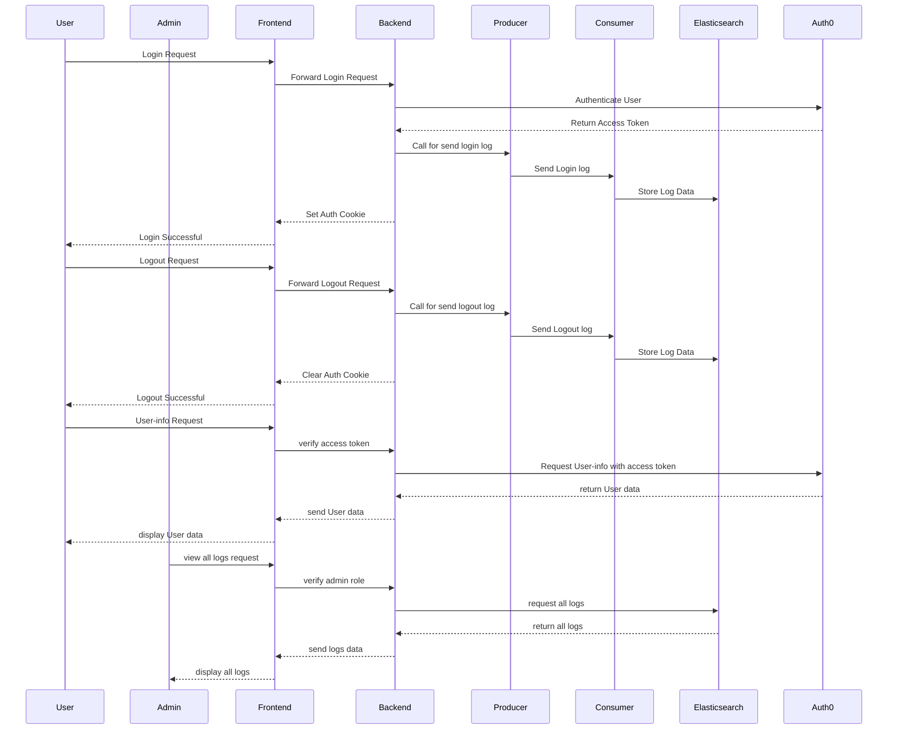

# Log Process

## Overview
This project utilizes Nodejs, Kafka, Elasticsearch, Docker, and Auth0 as the authentication provider. It focuses on log processing to provide real-time insights. When a user logs in or out, the log is sent via Kafka to Elasticsearch. Only administrators have access to view the logs.

## Features
- Send and receive logs when users log in and log out.
- Manage user roles.
- Allow only administrators to view logs.

## Setup
1. Clone the repository:
    ```bash
    git clone https://github.com/ThePeet25/log-process
    ```
2. Navigate to the project directory:
    ```bash
    cd log-process
    ```
3. Install dependencies:
    ```bash
    npm install
    ```

## How to use
1. Start docker-compose:
    ```bash
    docker-compose up -d --build
    ```
1. Start the log processing service:
    ```bash
    npm start
    ```
2. Access the dashboard at `http://localhost:3000`.

## Environment Variables
this is .env file. you can copy and place to .env on /log-process/.env

```
#server config
BASE_URL = http://localhost:3000
PORT = 3000

#Database ( PostgresSQL )
DB_HOST = localhost
DB_PORT = 5432
DB_USER = myuser
DB_PASSWORD = 12345
DB_NAME = log-process

#Auht0
AUTH_DOMAIN = dev-rw8npba0icf0l7fd.us.auth0.com
SESSION_SECRET = 298c3ddf7ed33dd0b5d7d14ec98225b23670304910492daeadcb8645ba7fefc8 
CLIENT_ID = fnuk9p4RBKkq5ybmsPXr0TnC6ZNHauew
CLIENT_SECRET = uftBQB12i0SyK08zcd8ZwygQSZYj41HiXVZZlWKL_1iyAHI3F70WeUv9IcGr5lK7
AUTH_CALLBACK = http://localhost:3000/callback

#kafka
KAFKA_BROKER = localhost:9092,localhost:9093

#elasticsearch
ELASTICSEARCH_HOST = http://localhost:9200
```

## Infomation
Auth0: authentication and manage user roles.

Kafka 
- producer: send log to consumer
- consumer: recieve log from producer and collect to Elasticsearch

Elasticsearch: collect logs

Nodejs: manage backend
- create log in API to Auth0 
- create call back API to  recieve accestoken to collect in cookie
- crate log out API to log out
- create middleware to send log before user log out
- create user info API to display user data from Auth0

EJS: display basic frontend

PostgreSQL: setup for future feature

## API Endpoints
 Method | Endpoint | Description | Auth Required 
------ | ----- | ----- | ----- |
GET | /login | log in with auth0 | none |
GET | /callback | return from login and get access token | none |
GET | /logout | log out | none |
GET | /user-info | get user data | access token |
GET | /search/all-log | view all logs | admin role |
GET | /search/all-log?email= | view log search by email | admin role |

## Diagram


## Contact
Email : 66200383@kmitl.ac.th

Github: https://github.com/ThePeet25

